# Chapter 12 프로세스 동기화

##### 목차
1. 동기화란
2. 동기화 기법


## 동기화란

#### 동기화의 의미

서로 다른 프로세스는 서로 데이터를 주고받으며 협력하며 실행될 수 있음
워드프로세스에는 사용자로부터 입력을 받는 프로세스, 입력된 내용의 맞춤법을 검사하는 프로세스, 입력 내용을 화면에 출력하는 프로세스 등이 있음.
이렇게 협력적으로 실행되는 프로세스는 아무렇게나 동시에 실행되면 안된다.
이를 방지하고 협력하는 프로세스들이 올바르게 실행되도록 하는것이 동기화

동기화
- 사전적 의미 : 작업들 사이의 수행 시기를 맞추는 것
- 특정 자원에 접근할 때 한개의 프로세스만 접근하게 하거나, 프로세스를 올바른 순서대로 실행하게 하는 것

프로세스 동기화
- 프로세스들 사이의 수행 시기를 맞추는 것
    - 실행 순서 제어 : 프로세스를 올바른 순서대로 실행하기
    - 상호 배제 : 동시에 접근해서는 안되는 자원에 하나의 프로세스가 접근하게 하기

##### 실행 순서 제어를 위한 동기화
Book.txt 에 입력을 하는 Writer 프로세스와 Book.txt. 파일에 저장된 값을 읽어들이는 Reader 프로세스가 있다고 가정한다.
두 프로세스는 실행 순서가 필요
- Reader 프로세스는 Writer 프로세스로 Book.txt에 값을 입력한 후, Book.txt에 값이 존재한다는 조건이 만족될 때 실행될 수 있다.
실행 순서 제어를 위한 동기화 : 동시에 실행되는 프로세스를 올바른 순서대로 실행하는 것

##### 상호 배제를 위한 동기화
상호 배제 : 공유(최유 엌)가 불가능한 자원의 동시 사용을 피하기 위해 사용되는 알고리즘

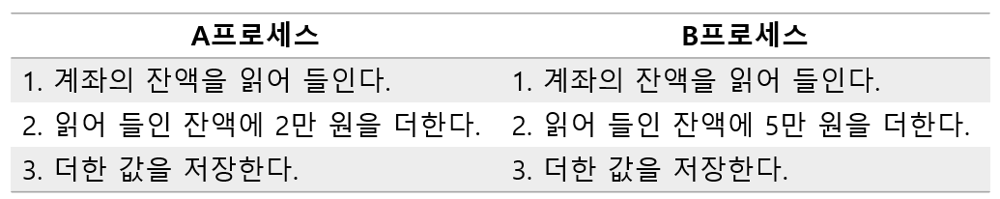


위와 같이 A는 계좌에 2만원을 추가하는 프로세스, B는 계좌에 5만원을 추가하는 프로세스이고, 계좌에는 현재 10만원이 있다고 가정하자.


**동기화가 이루어 지지 않은 경우**

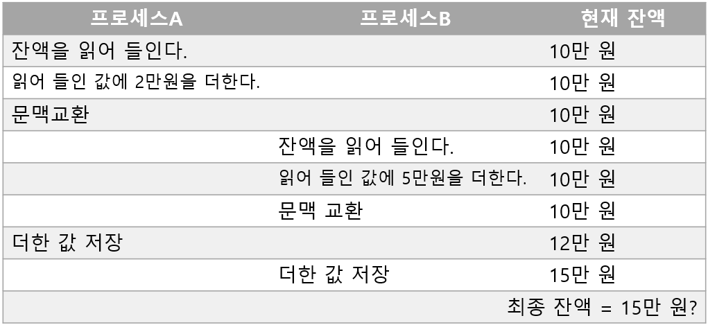

A와 B가 '잔액'이라는 데이터를 동시에 사용하는데, A의 더한 값 저장이 끝나기 전에 B가 '잔액'을 읽어버렸기 때문에 예상과는 다른 결과가 나온다.


올바른 실행을 위해서 한 프로세스가 '잔액'에 접근했을 때 다른 프로세스는 아래와 같이 기다려야 한다.


**동기화가 이루어진 경우**

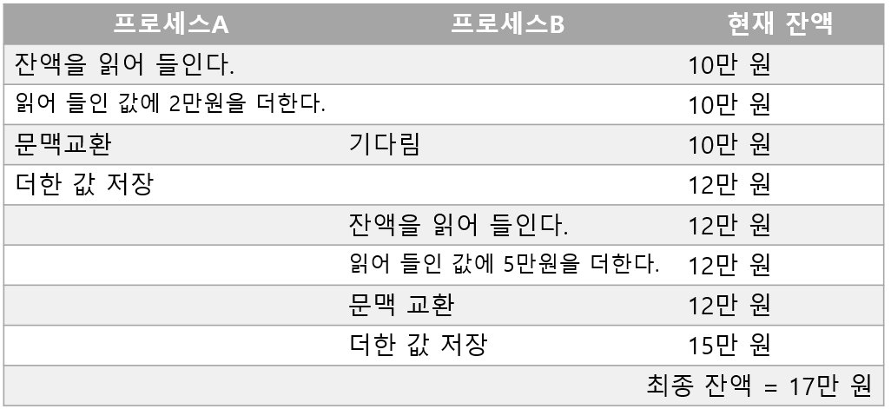


상호 배제를 위한 동기화 : 동시에 접근해서는 안 되는 자원에 동시에 접근하지 못하게 하는 것

#### 생산자와 소비자 문제

상호 배제를 위한 동기화의 유명한 문제

생산자와 소비자는 ‘총합’이라는 데이터를 공유

생산자는 버퍼에 물건(데이터)을 넣은 후, 물건의 총합 +1
소비자는 버퍼에서 물건(데이터)을 뺀 후, 물건의 총합 -1

```
생산자 () {
	버퍼에 데이터 삽입
	'총합' 변수 1 증가
}
```

```
소비자 () {
	버퍼에서 데이터 빼내기
	'총합' 변수 1 감소
}
```


```
총합 = 10

소비자 () {
	버퍼에서 데이터 빼내기
	'총합' 변수 1 감소
}

생산자 () {
	버퍼에 데이터 삽입
	'총합' 변수 1 증가
}
```


위와 같은 상태에서 생산자 10만번, 소비자 10만번 동시에 실행하면 결과 총합은 10이 될것이라 예상할 수 있음
그러나 생산자 프로세스와 소비자 프로세스가 제대로 동기화되지 않았다면 결과가 예상값과 다를 수 있음
생산자와 소비자는 ‘총합’이라는 데이터를 공유함
만약 생산자(소비자)가 소비자(생산자)의 작업이 끝나기도 전에 총합을 수정한다면, 예상된 결과가 나올 수 없음

**소비자 생산자 예제 코드**

https://github.com/kangtegong/self-learning-cs/blob/main/producer_consumer/producer_consumer.md


#### 공유 자원과 임계 구역

계좌 잔액 문제와 생산자 소비자 문제는 동시에 접근해서는 안 되는 자원에 동시에 접근해서 문제가 발생함(동기화가 되지 않음)


##### 공유 자원
- 계좌 잔액 문제와 생산자 소비자 문제에서 동시에 실행되는 프로세스들은 전역 변수 ‘잔액’과 ‘총합’이라는 공동의 자원을 두고 작업함
- 이러한 자원을 공유 자원이라고 함
- 공유자원은 전역 변수, 파일, 입출력장치, 보조기억장치가 될 수 있다.


공유자원중에서는 계좌 문제의 ‘잔액’과 생산자 소비자 문제의 ‘총합’ 변수처럼 두개 이상의 프로세스를 동시에 실행하면 문제가 발생하는 자원이 있음
이러한 자원에 접근하는 코드 영역을 ‘임계 구역’ 이라고 함

- 둘 이상의 프로세스가 임계구역에 진입하려 하면 둘 중 하나는 대기
- 임계 구역에 먼저 진입한 프로세스의 작업이 끝나면, 기다렸던 프로세스가 임계 구역에 진입


레이스 컨디션 : 
- 잘못된 실행으로 여러 프로세스가 동시 다발적으로 임계 구역의 코드를 실행하여 문제가 발생하는 상황

- 레이스 컨디션이 발생하면 예시 문제들 처럼 데이터의 일관성이 깨짐

- 근본적인 이유
    - 고급 언어는 실행 과정에서 저급 언어로 변환되어 실행된다(03장 내용)
    
    - 생산자 소비자 문제의 코드를 저급 언어로 변환하면 아래와 같음
    
    - ```
      총합 ++;   		// 총합 변수를 1 증가시키는 코드
      
      
      r1 = 총합;		// 총합 변수를 레지스터에 저장
      r1 = r1 + 1;	 // 레지스터 값 1 증가
      총합 = r1;		// 레지스터 값을 총합 변수에 저장 
      ```
    
    - ```
      총합 --;			// 총합 변수를 1 감소시키는 코드
      
      
      r2 = 총합;		// 총합 변수를 레지스터에 저장
      r2 = r2 - 1;	 // 레지스터 값 1 감소
      총합 = r2;		// 레지스터 값을 총합 변수에 저장
      ```
    
    - 이러한 저급 언어로 변환된 고급 언어 한 줄을 실행하는 과정에서 문맥교환이 발생항하면 아래와 같은 문제가 발생
    
      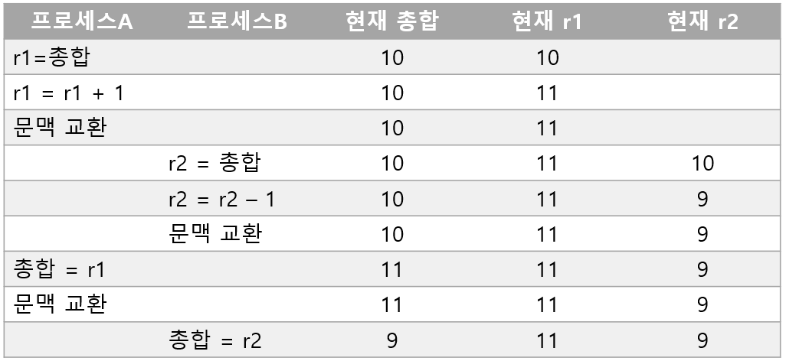


이때 상호 배제를 위한 동기화 : 두 개 이상의 프로세스가 임계 구역에 동시에 접근하지 못하도록 관리하는 것


운영체제는 이러한 임계 구역 문제를 해결하기 위해 3가지 원칙을 지킴
- 상호 배제 : 한 프로세스가 임계 구역에 진입했다면 다른 프로세스는 임계 구역에 들어올 수 없다.
- 진행 : 임계 구역에 어떤 프로세스도 진입하지 않았다면 임계 구역에 진입하고자 하는 프로세스는 들어갈 수 있어야 한다.
- 유한 대기 : 한 프로세스가 임계 구역에 진입하고 싶다면 그 프로세스는 언젠가는 임계 구역에 들어올 수 있어야 한다.(임계 구역에 들어오기 위해 무한정 대기해서는 안됨)


## 동기화 기법


#### 뮤텍스 락


두개 이상의 프로세스가 임계 구역에 들어가면 안됨
때문에 임계 구역에 진입하기 전에 현재 다른 프로세스가 임계 구역에 있는지를 확인해야함


뮤텍스 락(MUTual EXclusion lock)  

- 동시에 접근해서는 안되는 자원에 동시에 접근하지 않도록 만드는 도구 / 상호 배제를 위한 동기화 도구
- 뮤텍스 락을 이용해 임계 구역에 좌물쇠를 걸어둘 수 있음
- 다른 프로세스는 임계 구역의 잠김 여부를 확인하고 임계 구역에 들어갈지 말지를 결정함
- 하나의 전역 변수와 두개의 함수로 뮤택스 락의 단순한 형태를 구현 가능
    - 좌물쇠 역할 : 프로세스들이 공유하는 전역 변수 lock
    - 임계 구역을 잠그는 역할 : acquire 함수
    - 임계 구역의 잠금을 해제하는 역할 : release 함수


acquire 함수

- 프로세스가 임계 구역에 진입하기전에 호출하는 함수
- 임계 구역이 잠겨있으면 임계 구역이 열릴때 까지(lock 이 false가 될 때 까지) 임계 구역을 반복적으로 확인
- 임계 구역이 열려있다면 임계 구역을 잠금(lock을 true로 바꿈)

```
acquire() {
	while (lock == true)		// 만약 임계 구역이 잠겨 있다면
		;						// 임계 구역이 잠겨 있는지를 반복적으로 확인
	lock = true;				// 만약 임계 구역이 잠겨 있지 않다면 임계 구역 잠금
}
```


release 함수
- 임계 구역에서의 작업이 끝나고 호출하는 함수
- 현재 잠긴 임계 구역을 열어줌(lock을 false로 바꿈)

```
release() {
	lock = false;				// 임계 구역 작업이 끝났으니 잠금 해제
}
```


acquire 와 release 함수를 아래와 같이 임계 구역 전후로 호출함으로써 하나의 프로세스만 임계구역에 진입할 수 있음
```
acquire();				// 좌물쇠 잠겨 있는지 확인, 잠겨 있지 않다면 잠그고 들어가기
//임계 구역				 // 임계 구역에서의 작업 진행
release();			   // 좌물쇠 반환
```


뮤텍스 락을 사용한 프로세스의 임계 구역 진입 방식
- 락이 걸려있다면 락이 풀릴때 까지 무작정 기다림
- 락이 풀려있다면 임계 구역을 잠근 뒤 임계 구역내에서의 작업 진행
- 임계 구역에서 작업이 완료되면 임계 구역을 빠져나오며 잠금 해제

acquire 함수는 임계 구역이 잠겨있는 경우 프로세스는 반복적으로 lock을 확인함
```
	while (lock == true)		// 만약 임계 구역이 잠겨 있다면
		;						// 임계 구역이 잠겨 있는지를 반복적으로 확인
```

바쁜 대기 : 위 처럼 lock이 풀려있는지 쉴 새 없이 반복하며 대기하는 방식

** C/C++, Python 등의 일부 프로그래밍 언어에서는 사용자가 직접 acquire, release 함수를 구현하지 않도록 뮤텍스 락 기능 제공. (앞서 소개한 구현보다 정교하게 설계되어 있음)


#### 세마포

세마포
- 공유자원이 여러개 있는 상황에서 적용이 가능한 동기화 도구
- 뮤택스는 공유자원이 하나일 때 적용

세마포는 뮤텍스 락과 비슷하게 하나의 변수와 두개의 함수로 단순 구현할 수 있음
- 임계 구역에 진입할 수 있는 프로세스의 개수(사용 가능한 공유 자원의 개수)를 나타내는 전역 변수 S
- 임계 구역에 진입 가능한지 아닌지를 알려주는 함수 wait
- 임계 구역 진입을 기다리는 프로세스에 ‘진입 가능’ 신호를 주는 함수 signal

Wait 함수
```
wait () {
	while (S <= 0)		// 만일 임계 구역에 진입할 수 있는 프로세스 개수가 0 이하라면
	;					// 사용할 수 있는 자원이 있는지 반복적으로 확인하고,
	S--;				// 임계 구역에 진입할 수 있는 프로세스 개수가 1 이상이면 S를 1 감소시키고 임계 구역 진입
}
```


Signal 함수
```
signal () {
	S++					// 임계 구역에서의 작업을 마친 뒤 S를 1 증가시킨다.
}
```


임계 구역 진입 전후로 wait() 와 signal() 호출
```
wait()
//임계구역
signal()
```


3개의 프로세스 P1, P2, P3가 두 개의 공유 자원에 순서대로 접근한다고 가정
공유 자원 2개 -> S = 2
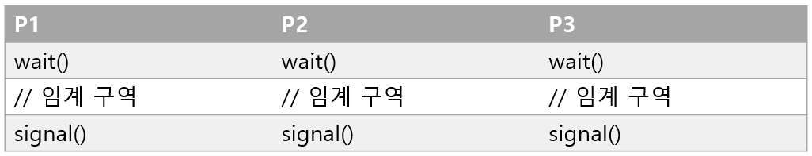

1. 프로세스 P1 wait 호출, S는 현재 2이므로 S를 1 감소시키고 임계 구역 진입
2. 프로세스 P2 wait 호출, S는 현재 1이므로 S를 1 감소시키고 임계 구역 진입
3. 프로세스 P3 wait 호출, S는 현재 0이므로 무한히 반복하며 S 확인
4. 프로세스 P1 임계 구역 작업 종류, signal 호출, S 1증가
5. 프로세스 P3 S가 1이 됨을 확인, S는 현재 1이므로 S를 1 감소시키고 임계 구역 진입

위와 같이 임계 구역 진입이 이루어지면 뮤텍스 락과 똑같이, 사용할 수 있는 공유 자원이 없을 때 프로세스는 무한히 반복하며 S를 확인해야하는 바쁜 대기 발생

실제 세마포는 다른 방법으로 이를 해결함
Wait함수는 사용할 수 있는 자원이 없는 경우 해당 프로세스를 대기 상태로 만듬
그리고 해당 프로세스의 PCB를 세마포를 위한 대기 큐에 삽입

다른 프로세스가 임계 구역에서의 작업이 끝나고 signal함수를 호출하면 signal함수는 대기중인 프로세스를 대기 큐에서 제거하고, 프로세스 상태를 준비상태로 변경한 뒤 준비 큐로 옮김

Wait 함수
```
wait() {
	S--;
	if (S < 0) {
		add this process to Queue;		// 해당 프로세스 PCB를 대기 큐에 삽입한다.
		sleep();						// 대기 상태로 접어든다.
	}
}
```

Signal 함수
```
signal() {
	S++;
	if (S <= 0) {
		remove a process p from Queue;	// 대기 큐에 있는 프로세스 p를 제거한다.
		wakeup(p)						// 프로세스 p를 대기 상태에서 준비 상태로 만든다.
	}
}
```


위의 wait, signal 함수를 적용하여 다시 예시 파악


1. 프로세스 P1 wait 호출, S는 현재 2이므로 S를 1 감소시키고 임계 구역 진입
2. 프로세스 P2 wait 호출, S는 현재 1이므로 S를 1 감소시키고 임계 구역 진입
3. 프로세스 P3 wait호출, S를 1 감소시키면 S는 -1 이므로 본인의 PCB를 대기 큐에 넣고 대기상태로 전환
4. 프로세스 P1 임계 구역 작업 종료, signal 호출, S를 1 증가하면 0이므로 대기 상태였던 P3를 대기 큐에서 꺼내 준비 큐로 옮겨줌
5. 프로세스 P3 임계 구역 진입
6. 프로세스 P2 임계 구역 작업 종료, signal 호출, S 1 증가
7. 프로세스 P3 임계 구역 작업 종료, signal 호출, S 1 증가


위까지의 내용은 ‘세마포를 이용한 상호 배제를 위한 동기화 기법’


세마포를 이용해 프로세스의 순서를 제어하는 방법
- 세마포의 변수 S를 0으로 둠
- 먼저 실행할 프로세스 뒤에 signal 함수, 다음에 실행할 프로세스 앞에 wait 함수를 붙임


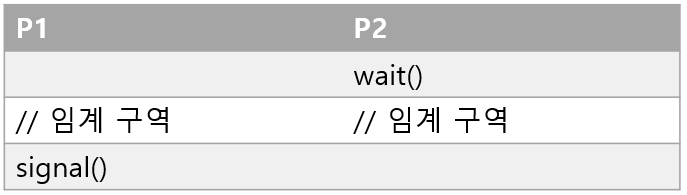
P1이 먼저 실행되면 P1이 임계구역에 먼저 진입함
P2가 먼저 실행되면 wait함수로 인해 signal 함수가 호출될 때 까지 대기상태에 머뭄
후에 P1이 실행되면 바로 임계 구역 진입
P1의 임계 구역 작업이 종료되면 signal 함수 호출하여 P2가 임계 구역에 진입

#### 모니터

세마포는 wait와 signal함수를 명시하는 것이 번거로움
잘못된 코드로 세마포를 누락, wait/signal순서 뒤바뀜, wait/signal 함수 중복

**모니터**

- 세마포에 비해 사용자가 사용하기 편리
- 공유 자원과 공유 자원에 접근하기 위한 인터페이스(통로)를 묶어서 관리
- 프로세스는 반드시 인터페이스를 통해서만 공유 자원에 접근하도록 함

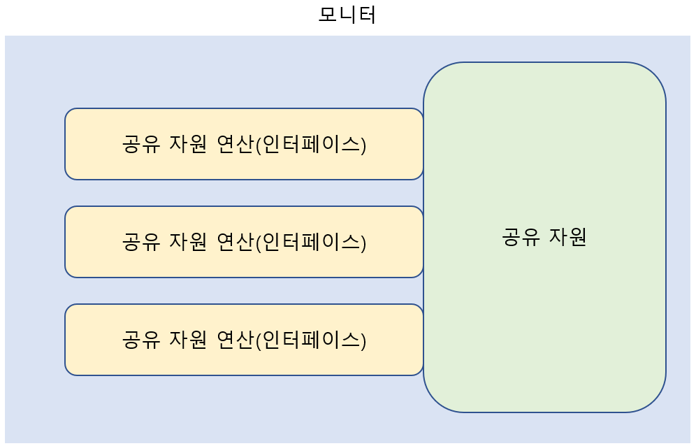


- 모니터를 통해 공유 자원에 접근하고자 하는 프로세스는 큐에 삽입되고, 큐에 삽입된 순서대로 하나씩 공유자원을 이용할 수 있다.
- 모니터는 공유 자원을 다루는 인터페이스에 접근하기 위한 큐(모니터에 진입하기 위한 큐)를 만들고, 모니터 안에 항상 하나의 프로세스만 들어오도록 하여 상보 배제를 위한 동기화를 제공

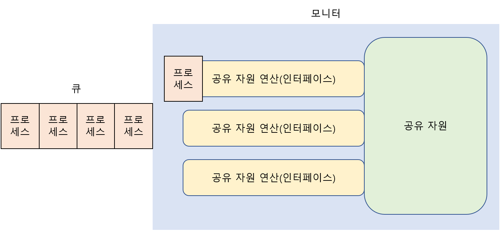

- 위처럼 동작함으로써 모니터는 상호 배제를 위한 동기화를 실행함


모니터는 실행 순서 제어를 위한 동기화도 제공

- 특정 조건을 바탕으로 프로세스를 일시 중단하기 위해 모니터는 **조건변수** 사용
- 조건변수 : 프로세스나 스레드의 실행 순서를 제어하기 위해 사용하는 변수
- 즉 a라는 조건이 충족되어야 실행될 수 있는 프로세스의 실행을 잠시 멈춰두고, 후에 a라는 조건이 충족되면 멈춰둔 프로세스를 실행시킨다.

wait

- 호출한 프로세스의 상태를 대기 상태로 전환하고 일시적으로 조견 변수에 대한 대기 큐에 삽입하는 연산
- 조건 변수에 대한 대기 큐 : 모니터에 이미 진입한 프로세스의 실행 조건이 만족될 때 까지 잠시 실행이 중단되어 기다리기 위해 만들어진 큐

signal

- wait를 호출하여 큐에 삽입된 프로세스의 실행을 재개하는 연산

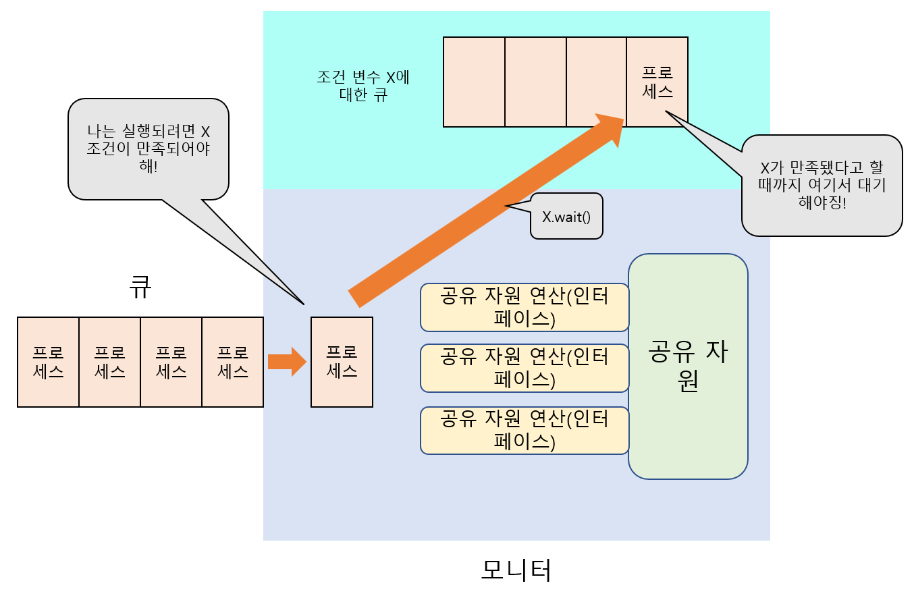

- 모니터에 진입한 프로세스가 X라는 조건이 충족되어야 실행될 수 있다면, X.wait()를 실행한다.
- X가 만족이 안되었다면 위 그림처럼 조건 변수 X에 대한 큐에 삽입된다.
- 모니터에는 프로세스가 비게 되고, 다른 프로세스가 들어올 수 있게 된다.


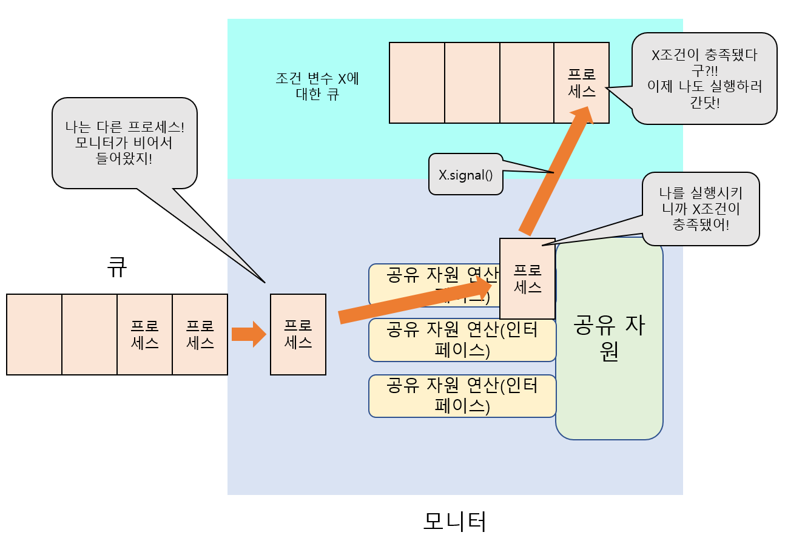

- 모니터에 프로세스가 비어있으므로, 모니터에 들어가기 위한 큐에 들어가있는 다음 프로세스가 모니터에 들어옴
- 이 프로세스가 실행되며 X라는 조건을 충족시키고 X.signal()호출한다.
- 조건 변수 X에 대한 큐에 있는 프로세스는 조건 X가 충족됨을 알게되며, 현재 모니터의 프로세스가 나가면, 모니터에 들어갈 준비를 한다.

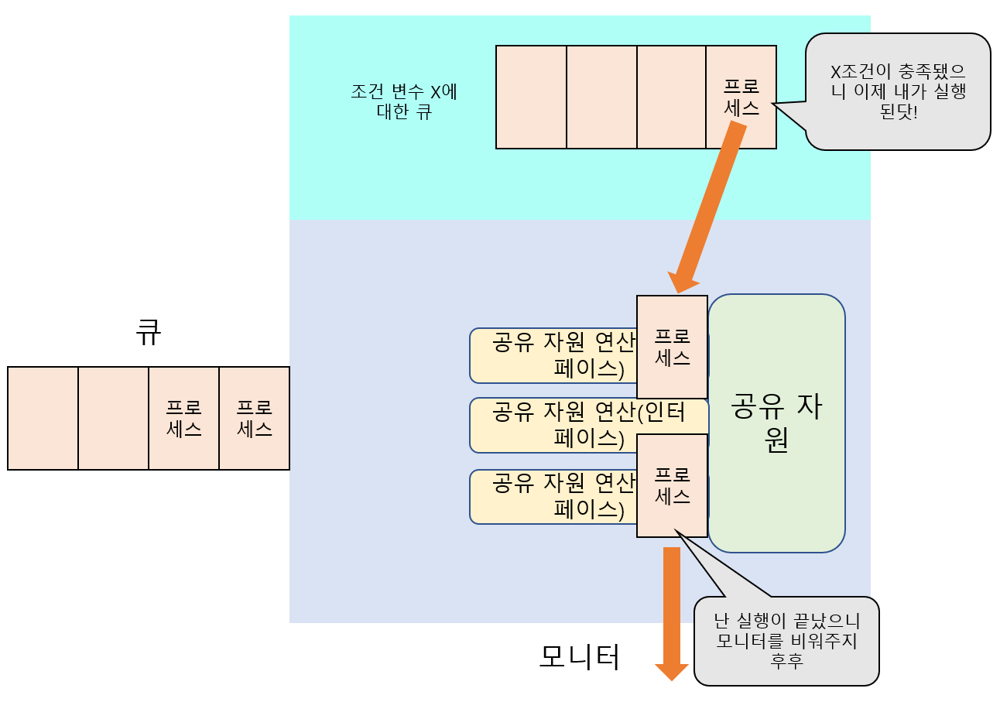

- 기존에 실행완료된 프로세스는 모니터에서 나감
- 그리고 X조건이 충족됨을 알게된(X.signal()로 호출된) 프로세스는 다시 모니터에 들어와 실행된다.


위처럼 모니터는 **조건 변수**와 wait(), signal() 함수를 통해 프로세스의 실행 순서 제어를 위한 동기화를 제공한다.